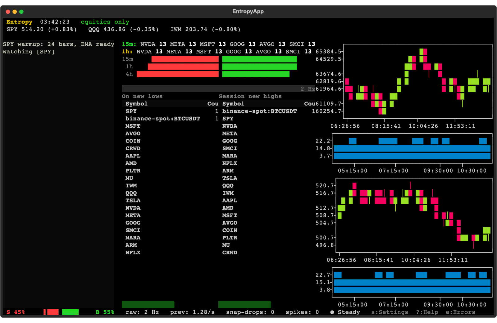

# Entropy

**A real-time terminal market scanner, algo console, and trading bot — in your terminal.**

Entropy is a [Textual](https://textual.textualize.io/) TUI that streams live crypto and simulated
equities, aggregates them into candlestick charts, and runs a breadth/"entropy" engine that surfaces
new highs & lows, spikes, and snap-drops across multiple rolling windows — all on a selectable
**15-minute-centric timeframe**.



---

## Highlights

- **15-minute operating timeframe, fully selectable.** Candles, scanner windows (`15m / 1h / 4h /
  session`), momentum horizon, breadth, and warmup all derive from one timeframe abstraction.
  Switch between `1m / 5m / 15m / 1h / 4h` live from the Settings screen — the engine and charts
  reconfigure on the fly.
- **Live + simulated feeds.** Real crypto ticks (Coinbase / Binance) alongside a deterministic
  equities simulator, unified through one engine.
- **Breadth / entropy engine.** Per-window new-high / new-low detection (O(1) monotonic windows),
  session extremes, spikes, snap-drops, buy/sell breadth, and an activity ticker.
- **Candlestick & line charts** with a toggleable volume pane, for both the crypto and equity legs.
- **A clean, sectioned Settings screen** — appearance, timeframe, data feeds, and scanner/engine
  thresholds, with live hot-apply and input validation. 7 built-in themes.
- **An automated trading bot** (`entropy bot`) — paper core with risk profiles, a live-execution
  scaffold, and a TUI dashboard — running on its own sub-second momentum cadence.
- **Strategy calibration & benchmarks** — grid-search back/forward accuracy tests and throughput
  /latency benchmarks from the CLI.

## Quick start

Entropy uses [uv](https://docs.astral.sh/uv/). From a clone:

```bash
uv sync            # resolve deps (pulls the crypcodile feed package from GitHub)
uv run entropy ui  # launch the scanner dashboard
```

Requires Python ≥ 3.12. The [crypcodile](https://github.com/nazmiefearmutcu/Crypcodile) feed package
is resolved automatically from GitHub via `[tool.uv.sources]`.

## Usage

```bash
uv run entropy ui          # main TUI scanner dashboard (default)
uv run entropy bot         # automated trade bot CLI / TUI
uv run entropy calibrate   # calibrate strategies + run back/forward accuracy tests
uv run entropy benchmark   # system throughput & latency benchmarks
```

Inside the dashboard: **`s`** Settings · **`?`/`h`** Help · **`e`** Errors · **`q`** Quit.

## Timeframes

The whole terminal is parameterized by a single timeframe registry. The default is **15m**; each
timeframe defines its bar interval, three rolling scanner windows, and the momentum/breadth cadence:

| Timeframe | Bar    | Scanner windows   |
|-----------|--------|-------------------|
| 1m        | 1 min  | 1m / 5m / 15m     |
| 5m        | 5 min  | 5m / 15m / 1h     |
| **15m**   | 15 min | **15m / 1h / 4h** |
| 1h        | 1 hr   | 1h / 4h / 1d      |
| 4h        | 4 hr   | 4h / 12h / 1d     |

(Plus the cumulative **session** high/low, always tracked.)

## Architecture

```
src/entropy/
  engine/    breadth/entropy engine, rolling windows, candle aggregation, timeframe registry
  feeds/     live crypto + simulated equities feeds, kline warmup
  strategy/  EMA / breakout signal engine used by the live TUI
  ui/        Textual app + widgets (charts, gauges, ticker, boards, settings modals), themes
  bot/       standalone trading bot — strategies, risk profiles, portfolio, runner, dashboard
  config.py  engine config (+ per-timeframe derivation)
  app.py     AppConfig
```

The main app runs on the selected timeframe (via `EngineConfig.from_timeframe(...)`), while the bot
keeps its own legacy sub-minute cadence — the two coexist through the same engine without
interfering.

## Development

```bash
uv run pytest             # full test suite
uv run ruff check src tests
uv run mypy src
```

## License

Apache-2.0.
