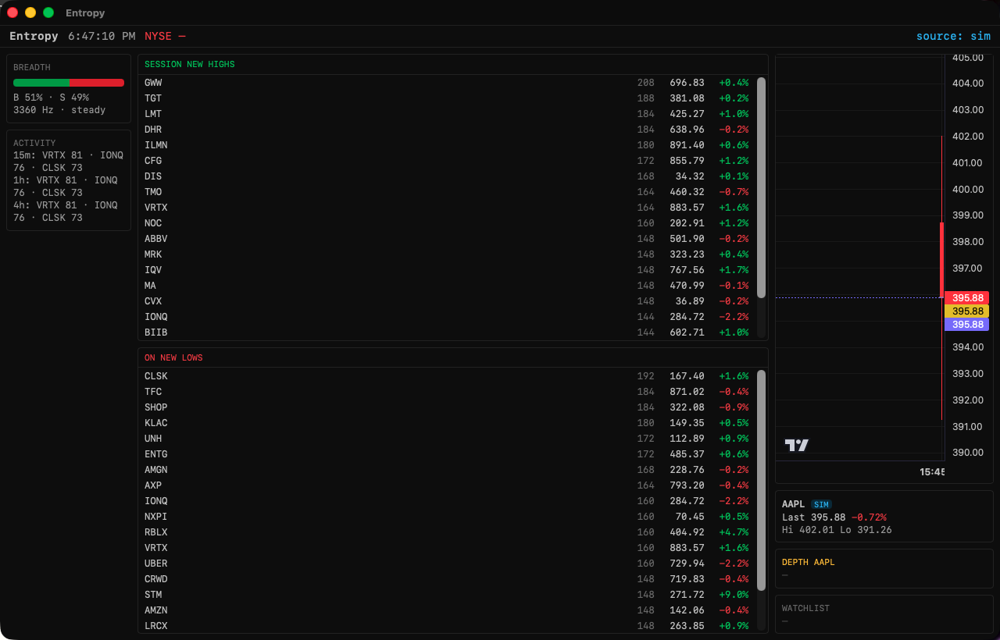

# Entropy

**Real-time market-breadth scanner and algo console. Terminal app or native macOS app, same engine.**

Entropy watches a few hundred symbols at once and tells you what the tape is doing right now — what's
printing new highs and lows across rolling windows, where breadth is tilting, which names are spiking
or snapping. It sits that next to a focus chart, a quote panel, and an order-book ladder in one dense
view. Runs in a terminal, or as a native macOS window over the same Python engine.

| Terminal (TUI) | Native macOS app |
| :---: | :---: |
| [](docs/assets/entropy.png) | [](docs/assets/entropy-native.png) |

Live crypto (Coinbase / Binance) and US equities feed the engine; a seeded simulator stands in when
there's no market open or no API keys. One timeframe drives everything — the candles, the three
scanner windows, momentum and breadth cadence, chart warmup — and it's switchable live (default 15m).

**Two things stated plainly.** The keyless defaults are approximations, not exchange truth: scraped
last-prices re-emitted as ticks, and a *synthetic* depth ladder inferred from 1-minute bars (real
feeds are a keys-away upgrade — see [Data](#data)). And the bundled bot tunes signal quality on the
streams it's handed, seeded-simulator numbers included. Neither is a claim of live-market edge.

## Run it

**Terminal** — needs Python 3.12+ and [uv](https://docs.astral.sh/uv/):

```bash
uv sync              # pulls the crypcodile + stockodile feed packages from GitHub
uv run entropy ui    # scanner dashboard
```

**Native macOS app** — grab the [latest `.dmg`](https://github.com/nazmiefearmutcu/Entropy/releases/latest)
(Apple Silicon) or build from [`native/README.md`](native/README.md). The engine is bundled, so
there's nothing else to install.

> Unsigned build. On first launch: right-click `Entropy.app` → **Open**, or run
> `xattr -cr /Applications/Entropy.app`.

## In the terminal

```bash
uv run entropy ui --equity-source auto     # live equities while NYSE is open, else sim
uv run entropy bot                         # trading bot (paper core + live-execution scaffold)
uv run entropy calibrate --walk-forward 4  # walk-forward K-fold out-of-sample calibration
uv run entropy benchmark                   # throughput + latency
```

The dashboard is keyboard-first:

| Key       | Action                                                                          |
|-----------|---------------------------------------------------------------------------------|
| `/`       | Symbol search (~500 US tickers + crypto majors)                                 |
| `w`       | Toggle the focused symbol on the watchlist                                       |
| `:`       | Command bar — `chart` / `watch` / `tf` / `theme` / `source` / `depth` / `help`   |
| `s`       | Settings (appearance, timeframe, feeds, scanner thresholds — all hot-apply)      |
| `?` / `h` | Help · `e` Errors · `q` Quit                                                     |

`:` is a Bloomberg-style command line — `chart AAPL`, `tf 15m`, `source live`, `depth NVDA`. The focus
chart follows whatever you select (search, a board row, a command) with EMA9/21 overlays and up/down
volume; the watchlist (persisted to `~/.entropy/`) carries last / Δ% / a sparkline per name. Seven
themes, live timeframe switching, no restarts.

## Data

Equities run in `sim`, `live`, or `auto` (live while NYSE is open per the market calendar). In live
mode, stockodile picks one provider from your environment:

| Provider           | Keys                                   | Data                                | Cap    |
|--------------------|----------------------------------------|-------------------------------------|--------|
| **Google Finance** | none (default)                         | last-price quotes polled every ~10s | none   |
| **Alpaca**         | `ALPACA_API_KEY` + `ALPACA_API_SECRET` | real IEX trades over websocket      | 30     |
| **Finnhub**        | `FINNHUB_API_KEY`                      | real trades over websocket          | 50     |

The keyless Google Finance path re-emits scraped last-prices as tick-rule trades — fine for scanning,
wrong for microstructure. Add Alpaca or Finnhub keys for real prints. Charts warm from real 15-minute
Yahoo bars either way, and the crypto leg (crypcodile) is unaffected.

The **depth ladder** (`:depth`) works the same keyless-then-upgrade way. With no keys it synthesizes a
volume-at-price ladder from free 1-minute bars — *where volume sat*, not resting orders — badged
`SYNTH`. Set the Alpaca keys and the exact same panel serves real L1 top-of-book (`L1`, live spread),
no code change. A rate-limited or failed fetch quietly degrades to `—` and never disturbs the scanner.

## Timeframes

A single registry parameterizes the whole terminal. Each timeframe sets its bar interval, three
rolling scanner windows, and the momentum/breadth cadence:

| Timeframe | Bar    | Scanner windows   |
|-----------|--------|-------------------|
| 1m        | 1 min  | 1m / 5m / 15m     |
| 5m        | 5 min  | 5m / 15m / 1h     |
| **15m**   | 15 min | **15m / 1h / 4h** |
| 1h        | 1 hr   | 1h / 4h / 1d      |
| 4h        | 4 hr   | 4h / 12h / 1d     |

The cumulative **session** high/low is always tracked on top of the three windows.

## The native app

Not a rewrite — a second frontend. A Tauri (Rust) shell spawns the Python engine headless as a bundled
sidecar, streams each `EngineSnapshot` over a local WebSocket at ~10 Hz, and renders the cockpit in
React — [lightweight-charts](https://github.com/tradingview/lightweight-charts) for candles, a DOM
depth ladder ported from the TUI, a `:` command bar. Same core as the terminal; the two are just
different windows onto it. Build steps and internals in [`native/README.md`](native/README.md).

## Layout

```
src/entropy/
  engine/    breadth/entropy engine, rolling windows, candle aggregation, timeframe registry
  feeds/     live crypto (crypcodile) + equities (stockodile: live / sim / auto), kline warmup
  data/      symbol universe (SEC EDGAR + crypto majors), persistent watchlist
  strategy/  EMA / breakout signal engine used by the live TUI
  ui/        Textual app + widgets (charts, quote/depth panels, search, command bar, boards…)
  bot/       standalone trading bot — strategies (consensus, ema_cross), risk, calibration, runner
native/
  sidecar/   FastAPI wrapper over the entropy engine (WebSocket stream + REST commands)
  frontend/  React + Vite + Tailwind cockpit
  tauri/     Rust shell — spawns the sidecar, opens the window
```

The main app runs on the selected timeframe; the bot keeps its own sub-minute cadence. One engine,
no interference.

## Development

```bash
uv run pytest                 # engine, feeds, UI, bot
uv run ruff check src tests
uv run mypy src
```

## License & disclaimer

Apache-2.0. This is a personal project, not investment advice. The bot's execution paths can place
real orders if you wire real broker keys — that's on you. Backtests and calibration numbers come from
a seeded simulator and imply nothing about live returns.
