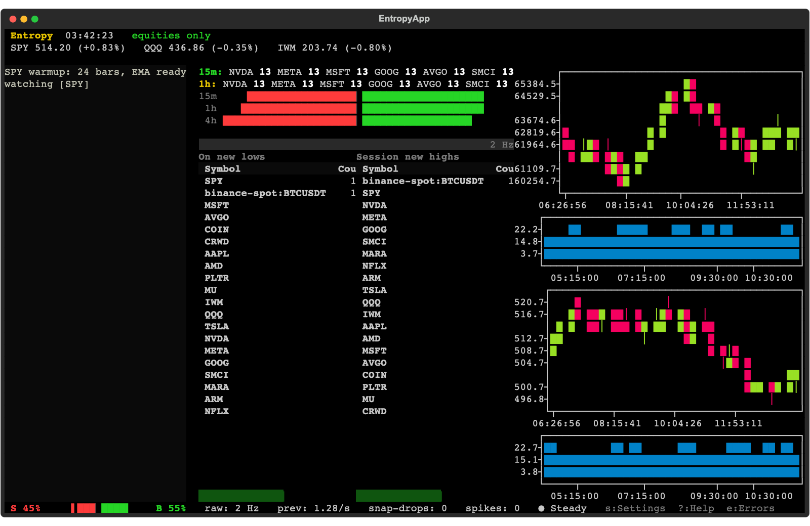
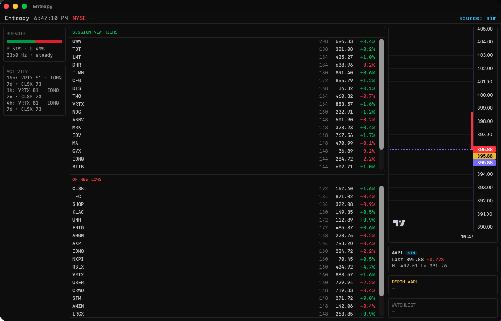

# Entropy

**Real-time market-breadth scanner and algo console. Terminal app or native macOS app, same engine.**

Entropy watches a few hundred symbols at once and tells you what the tape is doing right now — what's
printing new highs and lows across rolling windows, where breadth is tilting, which names are spiking
or snapping. It sits that next to a focus chart, a quote panel, and an order-book ladder in one dense
view. Runs in a terminal, or as a native macOS window over the same Python engine.

| Terminal (TUI) | Native macOS app |
| :---: | :---: |
| [](docs/assets/entropy.png) | [](docs/assets/entropy-native.png) |

Live crypto (Coinbase / Binance) and US equities feed the engine; a seeded simulator stands in when
there's no market open or no API keys. Three cadences are set independently and switch live: the
**scanner timeframe** (rolling windows, momentum, breadth — default 15m), the **chart candle
interval** (1s to 1d, or "follow the timeframe"), and the **bot's own computation cadence**. All of
it persists to `~/.entropy/settings.json`, shared by both frontends.

**Two things stated plainly.** The keyless defaults are approximations, not exchange truth: scraped
last-prices re-emitted as ticks, and a *synthetic* depth ladder inferred from 1-minute bars (real
feeds are a keys-away upgrade — see [Data](#data)). And the bundled bot tunes signal quality on the
streams it's handed, seeded-simulator numbers included. Neither is a claim of live-market edge.

## Run it

**Terminal** — needs Python 3.12+ and [uv](https://docs.astral.sh/uv/):

```bash
uv sync              # pulls the crocodile feed engine from GitHub
uv run entropy ui    # scanner dashboard
```

**Native macOS app** — grab the [latest `.dmg`](https://github.com/nazmiefearmutcu/Entropy/releases/latest)
(Apple Silicon) or build from [`native/README.md`](native/README.md). The engine is bundled, so
there's nothing else to install.

> Unsigned build. On first launch: right-click `Entropy.app` → **Open**, or run
> `xattr -cr /Applications/Entropy.app`.

## In the terminal

```bash
uv run entropy ui --equity-source auto     # live equities while NYSE is open, else sim
uv run entropy bot                         # trading bot (paper core + live-execution scaffold)
uv run entropy bot --timeframe 5m --vote-mode adaptive --strategies consensus
uv run entropy calibrate --walk-forward 4  # walk-forward K-fold out-of-sample calibration
uv run entropy benchmark                   # throughput + latency
```

The bot starts from your saved settings; flags override for that run only and are not written back.
`--ignore-saved` starts from built-in defaults.

The dashboard is keyboard-first:

| Key       | Action                                                                          |
|-----------|---------------------------------------------------------------------------------|
| `/`       | Symbol search (~500 US tickers + crypto majors)                                 |
| `w`       | Toggle the focused symbol on the watchlist                                       |
| `:`       | Command bar — `chart` / `watch` / `tf` / `theme` / `source` / `depth` / `help`   |
| `s`       | Settings (appearance, timeframe, feeds, scanner thresholds — all hot-apply)      |
| `?` / `h` | Help · `e` Errors · `q` Quit                                                     |

`:` is a Bloomberg-style command line — `chart AAPL`, `tf 15m`, `source live`, `depth NVDA`. The focus
chart follows whatever you select (search, a board row, a command) with EMA9/21 overlays and up/down
volume; the watchlist (persisted to `~/.entropy/`) carries last / Δ% / a sparkline per name. Seven
themes, live timeframe switching, no restarts.

## Data

Equities run in `sim`, `live`, or `auto` (live while NYSE is open per the market calendar). In live
mode, crocodile picks one provider from your environment:

| Provider           | Keys                                   | Data                                | Cap    |
|--------------------|----------------------------------------|-------------------------------------|--------|
| **Google Finance** | none (default)                         | last-price quotes polled every ~10s | none   |
| **Alpaca**         | `ALPACA_API_KEY` + `ALPACA_API_SECRET` | real IEX trades over websocket      | 30     |
| **Finnhub**        | `FINNHUB_API_KEY`                      | real trades over websocket          | 50     |

The keyless Google Finance path re-emits scraped last-prices as tick-rule trades — fine for scanning,
wrong for microstructure. Add Alpaca or Finnhub keys for real prints. Charts warm from real 15-minute
Yahoo bars either way, and the crypto leg is unaffected.

The **depth ladder** (`:depth`) works the same keyless-then-upgrade way. With no keys it synthesizes a
volume-at-price ladder from free 1-minute bars — *where volume sat*, not resting orders — badged
`SYNTH`. Set the Alpaca keys and the exact same panel serves real L1 top-of-book (`L1`, live spread),
no code change. A rate-limited or failed fetch quietly degrades to `—` and never disturbs the scanner.

## Timeframes

A single registry parameterizes the scanner. Each timeframe sets three rolling windows and the
momentum/breadth cadence:

| Timeframe | Default bar | Scanner windows   |
|-----------|-------------|-------------------|
| 1m        | 1 min       | 1m / 5m / 15m     |
| 5m        | 5 min       | 5m / 15m / 1h     |
| **15m**   | 15 min      | **15m / 1h / 4h** |
| 1h        | 1 hr        | 1h / 4h / 1d      |
| 4h        | 4 hr        | 4h / 12h / 1d     |

The cumulative **session** high/low is always tracked on top of the three windows.

**Chart candles are a separate knob.** The scanner timeframe and the candle width used to be one
setting, so watching 1-minute candles meant dropping the scanner to a 1-minute cadence too. They are
now independent: pick any interval from `1s` through `1d`, or leave it on *Follow timeframe* for the
old coupled behaviour. Sub-minute equity candles have no history provider (Yahoo starts at 1m), so
those charts fill from the live tape instead of warming — the app says so rather than silently
serving the wrong bars.

## The bot

The bot runs its own engine on its own cadence, and every parameter is now a setting rather than a
constant in the source: scanner timeframe, strategy bar length, indicator periods, vote weights and
thresholds, regime bounds, hold/cooldown, and the risk profile (with per-field overrides).

Its consensus strategy was rebuilt. The original scored every bar with a fixed mapping — EMA and
MACD voting trend-following, RSI and Bollinger voting mean-reversion — and those two families
disagree by construction exactly when a trend is strongest. A sustained rally pins RSI above 70 and
%B above 0.95, so the oscillators subtracted 0.35 from a 0.65 trend score and the 0.30 total never
cleared the 0.50 entry threshold. Measured on synthetic paths: a clean +44% trend over 600 bars
produced **zero** signals, while 200 bars of flat chop produced **36** (18 round trips). Silent in
trends, hyperactive in chop — precisely inverted.

`vote_mode` now defaults to `adaptive`: a Kaufman efficiency ratio classifies the bar as trending or
ranging, the oscillators are read for momentum confirmation in the former and mean-reversion in the
latter, and the weights tilt toward whichever block carries the information. On the same paths that
becomes 1 entry that rides the trend, and 3 signals across trend/chop/reversal instead of 38.
`vote_mode="legacy"` restores the original mapping bit-for-bit for reproducing old runs; the test
suite pins both behaviours.

Two reliability bugs went with it. Mechanical stops and take-profits closed positions without telling
the strategy, so after its first take-profit a strategy went on believing it was long and never
opened again for the rest of the move; risk-rejected entries left the same phantom state. The runner
now re-arms strategies on any close they did not ask for.

None of this is a claim of live-market edge. The numbers above are synthetic paths with no fees, and
they measure one thing: which way the strategy points and when it stays out.

### Costs are part of the model

The paper executor used to charge a flat 1 bp fee + 1 bp slippage per side — about 2x (equities) to
6.5x (crypto spot) cheaper than the largest venues actually charge. `BotConfig.market_costs` now
carries per-market taker schedules (researched 2026-08-02):

| Market | fee / slippage (bps per side) | Round trip `C` |
|---|---|---|
| Binance spot | 10.0 / 3.0 | 26 bps |
| Binance USDT-M futures | 5.0 / 2.0 | 14 bps |
| US equities (IBKR tiered) | 2.0 / 2.0 | 8 bps |

The flat `fee_bps`/`slippage_bps` remain as the fallback and the whole per-market table can be reset
with `MarketCostConfig.flat()`. To fully reproduce pre-cost runs set `cost_aware=False` in
`BotConfig`: the cost model becomes `None`, every gate is a no-op and only the flat fees apply —
legacy flat-fee runs then reproduce byte-for-byte.

With a cost model wired in, the strategy and risk layers enforce the standard cost equations:
round-trip cost `C = 2(fee + slippage)`; breakeven move `m* = C`; a regime floor
`mean|bar return| ≥ k·C` plus an expected-move gate `RMS(returns) ≥ k·C/0.798` (`k` =
`cost_edge_mult`, default 2.0) so a bar too quiet to pay its own round trip is not traded; an exit
band tightened by a cost buffer (the score must retrace deeper before exiting) so positions are held
through breakeven noise instead of being churned; and a churn guard in the risk layer rejecting
entries whose round trip is more than `max_cost_to_stop` (default 0.5) of the stop distance. Position
`validate()` refuses such a configuration up front — the CLI exits with a `config error` naming the
profile, market and ratio, and the settings surfaces (TUI, native cockpit) reject the save — so a
cost-aware run never starts with an entry set that would be rejected everywhere; raise
`max_cost_to_stop` (e.g. 0.55) or set `cost_aware=False` to run it anyway. Position sizing stays
risk-profile-driven; `costs.fee_adjusted_kelly()` documents the full-Kelly formula for anyone who
wants to go further.

`entropy calibrate` backtests stay flat-fee by default: `run_backtest` enables the cost-aware
gates only when `market_costs` is passed (or `cost_aware=True` is set explicitly), so
`market_costs=None` — the default — is the legacy flat-fee path with every gate off. See
`tests/bot/test_cost_aware.py` for the net-of-cost `costs_paid` metric (fees + slippage), and
`scripts/repro_backtest_claims.py` to reproduce the gates-off vs gates-on results on one seeded
tick stream, including the FROSTY+spot control where the cost-to-stop guard blocks every entry.

## The native app

Not a rewrite — a second frontend. A Tauri (Rust) shell spawns the Python engine headless as a bundled
sidecar, streams each `EngineSnapshot` over a local WebSocket at ~10 Hz, and renders the cockpit in
React — [lightweight-charts](https://github.com/tradingview/lightweight-charts) for candles, a DOM
depth ladder ported from the TUI, a `:` command bar. Same core as the terminal; the two are just
different windows onto it. Build steps and internals in [`native/README.md`](native/README.md).

## Layout

```
src/entropy/
  engine/    breadth/entropy engine, rolling windows, candle aggregation, timeframe registry
  feeds/     live crypto + equities (live / sim / auto) via crocodile, kline warmup
  data/      symbol universe (SEC EDGAR + crypto majors), persistent watchlist
  strategy/  EMA / breakout signal engine used by the live TUI
  ui/        Textual app + widgets (charts, quote/depth panels, search, command bar, boards…)
  bot/       standalone trading bot — strategies (consensus, ema_cross), risk, calibration, runner
native/
  sidecar/   FastAPI wrapper over the entropy engine (WebSocket stream + REST commands)
  frontend/  React + Vite + Tailwind cockpit
  tauri/     Rust shell — spawns the sidecar, opens the window
```

The scanner, the charts and the bot each run on their own configured cadence over the same engine
code. `src/entropy/settings.py` is the single persisted source of truth both frontends read and
write, so a change made in one shows up in the other.

## Development

```bash
uv run pytest                 # engine, feeds, UI, bot
uv run ruff check src tests
uv run mypy src
```

## License & disclaimer

[Apache-2.0](LICENSE). This is a personal project, not investment advice. The bot's execution paths can place
real orders if you wire real broker keys — that's on you. Backtests and calibration numbers come from
a seeded simulator and imply nothing about live returns.
